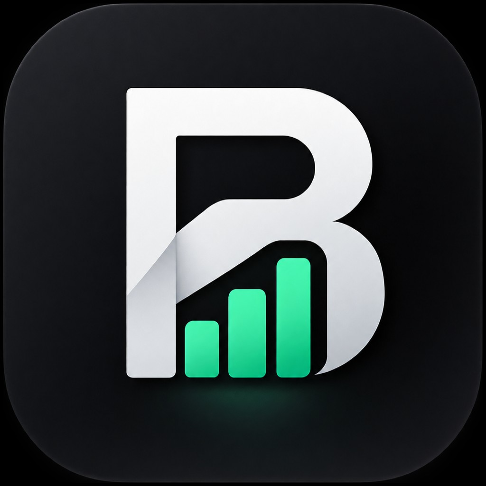

<p align="center">
  
</p>

<p align="center">
  <em>Logo et icône générés avec ChatGPT. / Logo and icon generated with ChatGPT.</em>
</p>

<h1 align="center">Budgethor</h1>

<p align="center">
  <a href="#francais">Français</a> · <a href="#english">English</a>
</p>

---

<a id="francais"></a>

## Français

App locale pour suivre **paies**, **paiements** et **dettes** — sans tracking.

Budgethor répond à une question simple : *combien me reste-t-il une fois les paies et les paiements prévus pris en compte ?*

Le tableau de bord sépare l’argent **déjà disponible** du solde **prévu en fin de mois**, et lit le mois (Bonne, À surveiller, Serrée) plutôt que de seulement additionner. Les dettes peuvent être liées à un compte : les charges l’augmentent, un virement la diminue.

Les montants sont stockés en **cents**, affichés en dollars canadiens. Tout reste sur la machine, dans une base SQLite.

### Fonctionnalités

- **Situation du mois** — disponible maintenant, reste prévu, revenus et paiements, plus une lecture de santé financière (seuil à 100 $ ou solde négatif, avec la date).
- **À traiter** — retards, échéances du jour et des 7 prochains jours, liste condensée.
- **Comptes** — argent (banque) ou crédit (carte), solde d’ouverture reporté du mois précédent.
- **Paies et paiements** — lignes éditables, modèles récurrents (hebdo, aux deux semaines, mensuel) éditables en place. Les paies dues sont marquées reçues automatiquement.
- **Dettes** — solde, mensualité, progression, prochain paiement. Simulation avalanche / snowball, drops et redirections, sans changer les soldes réels.
- **Mois** — navigation limitée au mois courant + 1. Historique des mois déjà générés.
- **Import CSV** — mapping vers paies, paiements, récurrents ou dettes.
- **Assistant de démarrage** et **thème** clair / sombre.

### Stack

| Couche | Choix |
| --- | --- |
| App | Next.js 16 (App Router), React 19, TypeScript |
| UI | Tailwind CSS 4, shadcn/ui (Base UI) |
| Données | SQLite (`better-sqlite3`), Drizzle ORM |
| Mutations | Server Actions |
| Runtime | Bun |

Les montants ne passent jamais par des `float`.

### Architecture

Monolithe local : pas d’API publique, pas de compte cloud.

- Schéma : `src/db/schema.ts`
- Lectures : `src/db/queries.ts`
- Écritures : `src/actions/budget.ts`
- Métier : `src/lib/` (totaux, santé financière, dettes, plan de remboursement, CSV)

Les migrations SQLite s’appliquent au démarrage.

### Lancer le projet

#### Prérequis

- [Bun](https://bun.sh) **1.3+** (le projet est verrouillé sur `bun@1.3.14`)
- Git

Installer Bun si besoin :

```bash
curl -fsSL https://bun.sh/install | bash
```

#### Installation

```bash
git clone https://github.com/zf-development/budgethor.git
cd budgethor
bun install
```

Aucune variable d’environnement n’est obligatoire. La base SQLite est créée automatiquement au premier lancement.

#### Mode développement

```bash
bun dev
```

Ouvrir [http://localhost:3000](http://localhost:3000). Au premier lancement, l’assistant crée les comptes et le mois courant.

#### Production (locale)

```bash
bun run build
bun start
```

L’app écoute ensuite sur [http://localhost:3000](http://localhost:3000).

#### Autres commandes

```bash
bun run lint
```

#### Base de données

- Fichier par défaut : `data/budgethor.db` (ignoré par Git)
- Autre chemin : définir `SQLITE_PATH` avant de lancer l’app

```bash
SQLITE_PATH=/chemin/vers/budgethor.db bun dev
```

### Confidentialité

Aucune donnée budgétaire n’est envoyée à un serveur. Usage personnel, pas un déploiement multi-utilisateurs.

### Auteur

[Zachary Gagné](https://github.com/zf-development) — développeur indépendant à Montréal.

[GitHub](https://github.com/zf-development) · [LinkedIn](https://www.linkedin.com/in/zgagne)

### Licence

Ce projet est sous licence [MIT](LICENSE).

### Crédits

Le logo et l’icône de l’application ont été générés avec ChatGPT.

---

<a id="english"></a>

## English

Local app to track **paycheques**, **payments**, and **debts** — no tracking.

Budgethor answers a simple question: *how much will I have left once planned paycheques and payments are accounted for?*

The dashboard separates money **already available** from the **expected end-of-month** balance, and reads the month (Healthy, Watch, Tight) instead of only adding numbers. Debts can be linked to an account: charges increase it, a transfer decreases it.

Amounts are stored in **cents** and shown in Canadian dollars. Everything stays on the machine, in a SQLite database.

### Features

- **Month snapshot** — available now, expected remainder, income and payments, plus a financial-health reading (threshold at $100 or a negative balance, with the date).
- **To handle** — overdue items, due today and in the next 7 days, condensed list.
- **Accounts** — cash (bank) or credit (card), opening balance carried from the previous month.
- **Paycheques and payments** — editable rows, in-place recurring templates (weekly, biweekly, monthly). Due paycheques are marked received automatically.
- **Debts** — balance, installment, progress, next payment. Avalanche / snowball simulation, drops and redirects, without changing real balances.
- **Months** — navigation limited to the current month + 1. History of months already generated.
- **CSV import** — mapping to paycheques, payments, recurrings, or debts.
- **Onboarding wizard** and **light / dark theme**.

### Stack

| Layer | Choice |
| --- | --- |
| App | Next.js 16 (App Router), React 19, TypeScript |
| UI | Tailwind CSS 4, shadcn/ui (Base UI) |
| Data | SQLite (`better-sqlite3`), Drizzle ORM |
| Mutations | Server Actions |
| Runtime | Bun |

Amounts never go through `float`.

### Architecture

Local monolith: no public API, no cloud account.

- Schema: `src/db/schema.ts`
- Reads: `src/db/queries.ts`
- Writes: `src/actions/budget.ts`
- Domain: `src/lib/` (totals, financial health, debts, payoff plan, CSV)

SQLite migrations run on startup.

### Running the project

#### Prerequisites

- [Bun](https://bun.sh) **1.3+** (the project is locked to `bun@1.3.14`)
- Git

Install Bun if needed:

```bash
curl -fsSL https://bun.sh/install | bash
```

#### Setup

```bash
git clone https://github.com/zf-development/budgethor.git
cd budgethor
bun install
```

No environment variables are required. The SQLite database is created automatically on first launch.

#### Development

```bash
bun dev
```

Open [http://localhost:3000](http://localhost:3000). On first launch, the wizard creates accounts and the current month.

#### Local production

```bash
bun run build
bun start
```

The app then listens on [http://localhost:3000](http://localhost:3000).

#### Other commands

```bash
bun run lint
```

#### Database

- Default file: `data/budgethor.db` (ignored by Git)
- Custom path: set `SQLITE_PATH` before starting the app

```bash
SQLITE_PATH=/path/to/budgethor.db bun dev
```

### Privacy

No budget data is sent to a server. Personal use only — not a multi-user deployment.

### Author

[Zachary Gagné](https://github.com/zf-development) — independent developer in Montreal.

[GitHub](https://github.com/zf-development) · [LinkedIn](https://www.linkedin.com/in/zgagne)

### License

This project is licensed under the [MIT](LICENSE) license.

### Credits

The app logo and icon were generated with ChatGPT.
